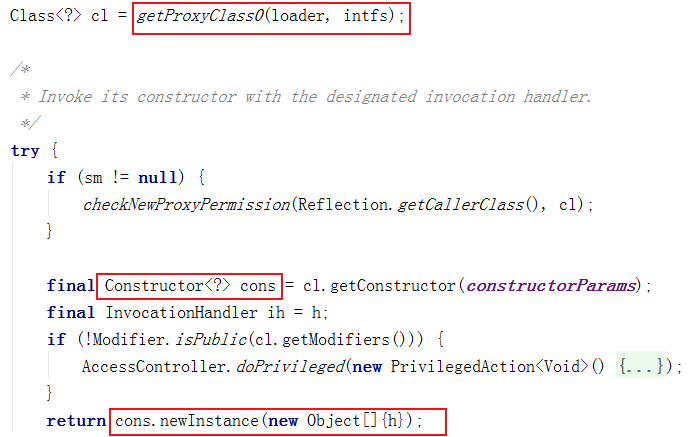
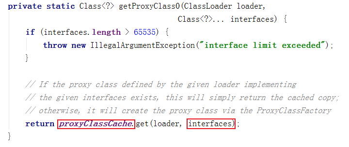
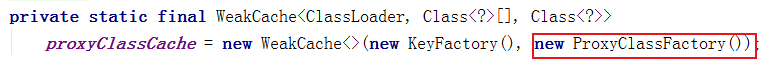
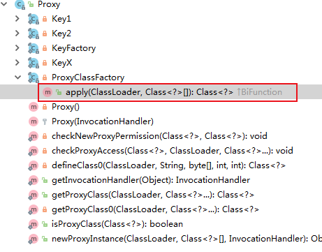
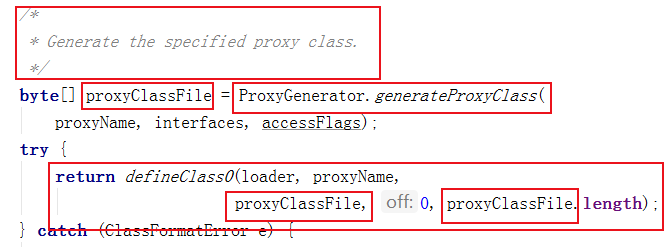
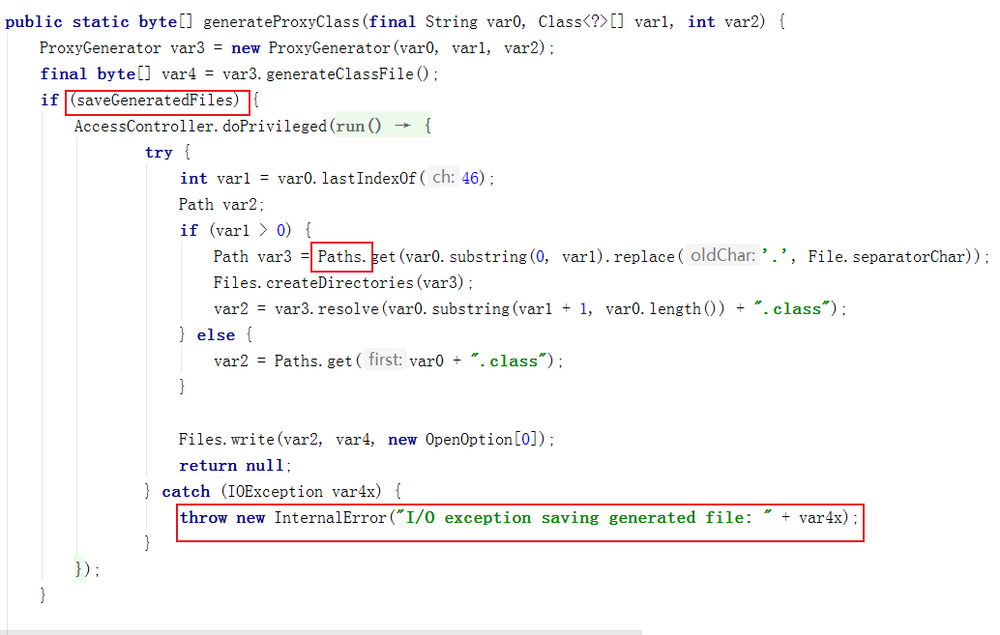

# 如何查看 Proxy 模式的 $ProxyX.class文件

	在学习 Proxy 的实现原理时我们要查看 $Proxy0.class 的代码，由于 $Proxy0.class 是在内存中的，所以我们需要写到本地。废话不多说，方式如下：

在调用动态代理的main方法中加上 

	System.getProperties().put("sun.misc.ProxyGenerator.saveGeneratedFiles", "true");    
	System.getProperties().put("sun.misc.ProxyGenerator.saveGeneratedFiles", true);//这个不对

这样在运行代码的时候就会在项目的根目录下生成 com.sun.proxy.$ProxyX.class 了，我们可以通过反编译来理解 Proxy 的处理过程。

当然，也可以通过

	Proxy.getProxyClass(真正用到的类.class.getClassLoader(), 真正用到的类.class)); 

来获取字节码，然后写到本地。

注意：上面的参数不是 Boolean 值，是字符串 "true"。当看到 System.getProperties 时你一定会认为这是个系统属性，出于好奇，我们查看一下系统属性都有哪些：

	public class Main {
	
	    public static void main(String[] args) {
	        Set set = System.getProperties().keySet();
	        if (!set.isEmpty()) {
	            Iterator iterator = set.iterator();
	            Object key = null;
	            while (iterator.hasNext()) {
	                key = iterator.next();
	                System.out.println(key + " : " + System.getProperties().get(key));
	            }
	        }
	    }
	}

打印结果为：

	java.runtime.name : Java(TM) SE Runtime Environment
	sun.boot.library.path : D:\Program Files\Java8\jdk1.8.0.181\jre\bin
	java.vm.version : 25.181-b13
	java.vm.vendor : Oracle Corporation
	。。。

由于结果太长，这里只截取一部分。不过你会发现系统属性中并没有 sun.misc.ProxyGenerator.saveGeneratedFiles 。 那么这个属性是从哪来的呢，如果没有来源这就是个魔法值，以后系统改了我们也无法知道，下面就从 Proxy 的代码中找到这个值得来源，以及为什么是字符串 true 而不是 boolean true。

在使用 Proxy 时必须要用到下面的这行代码，这也是 Proxy 的唯一入口，那么 sun.misc.ProxyGenerator.saveGeneratedFiles 也一定和这个类有关了。

	Subject subject = (Subject) Proxy.newProxyInstance(handler.getClass().getClassLoader(), realSubject
                .getClass().getInterfaces(), handler);

跟进 newProxyInstance 并找到返回值代码：

可以看出返回值是通过 Constructor 实例化的，如果你用过反射，想必对这个类不会陌生。那么这个实例的类型就是 c1 的类型了，而 c1 是通过 getProxyClass0 获得的，继续跟进：

通过代码我们可以看到 ProxyClassCache 是 WeakCache 类型的，所以 getProxyClass0 的返回值都在 ProxyClassCache 中并通过键值对获取，那么我们看一下 ProxyClassCache 是怎么实现的：

所以返回值都是 ProxyClassFactory 类型的，继续跟进：

通过 ProxyClassFactory 的结构图可以看到，这一个工厂模式，所有的实例都是通过 apply 方法返回的，

通过注释和代码我们可以看出代理类是通过 ProxyGenerator.generateProxyClass 生成的，继续跟进：

这里的文件我没有配置源码，是通过 class 文件反编译的，所以没有注释；但根据变量名称和抛出的 I/O 异常，可以猜测这里就是控制代理类文件生成与否的逻辑，那么我们看看 saveGeneratedFiles 是怎么定义的：

	private static final boolean saveGeneratedFiles = (Boolean)AccessController.doPrivileged(new GetBooleanAction("sun.misc.ProxyGenerator.saveGeneratedFiles"));

可以看到这就是文章开头我们写的那个属性，证明我们找对了，继续跟进 GetBooleanAction ：

	public class GetBooleanAction implements PrivilegedAction<Boolean> {
	    private String theProp;
	
	    public GetBooleanAction(String var1) {
	        this.theProp = var1;
	    }
	
	    public Boolean run() {
	        return Boolean.getBoolean(this.theProp);
	    }
	}

这个类很简单，只是实现了 PrivilegedAction 接口，PrivilegedAction 只有一个 run 方法和一堆注释，我们可以大胆的猜测：实现这个接口的目的就是为了用 run 方法提供相应的值，继续跟进 Boolean.getBoolean ：

    public static boolean getBoolean(String name) {
        boolean result = false;
        try {
            result = parseBoolean(System.getProperty(name));
        } catch (IllegalArgumentException | NullPointerException e) {
        }
        return result;
    }

由于 parseBoolean 的参数是 String 类型，这就解释了文章开头的为什么不是 boolean 类型的问题。

    